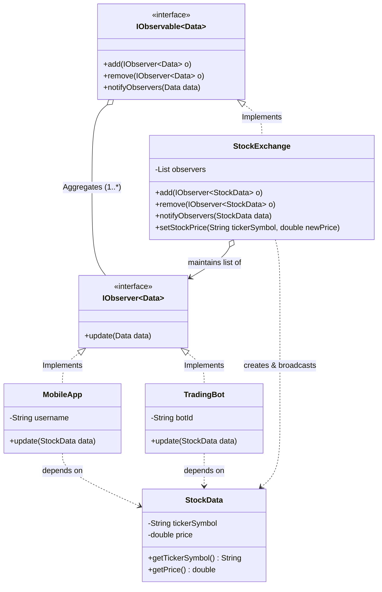

```mermaid
classDiagram
    direction TB

    %% Generic Interfaces
    class IObservable~Data~ {
        <<interface>>
        +add(IObserver~Data~ o)
        +remove(IObserver~Data~ o)
        +notifyObservers(Data data)
    }

    class IObserver~Data~ {
        <<interface>>
        +update(Data data)
    }

    %% Data Payload
    class StockData {
        -String tickerSymbol
        -double price
        +getTickerSymbol() String
        +getPrice() double
    }

    %% Concrete Observable (Subject)
    class StockExchange {
        -List observers
        +add(IObserver~StockData~ o)
        +remove(IObserver~StockData~ o)
        +notifyObservers(StockData data)
        +setStockPrice(String tickerSymbol, double newPrice)
    }

    %% Concrete Observers
    class MobileApp {
        -String username
        +update(StockData data)
    }

    class TradingBot {
        -String botId
        +update(StockData data)
    }

    %% Abstract Relationships
    IObservable~Data~ o-- IObserver~Data~ : Aggregates (1..*)

    %% Concrete Implementations (Realization)
    IObservable~StockData~ <|.. StockExchange : Implements
    IObserver~StockData~ <|.. MobileApp : Implements
    IObserver~StockData~ <|.. TradingBot : Implements

    %% Concrete Relationships
    StockExchange o--> IObserver~StockData~ : maintains list of
    MobileApp ..> StockData : depends on
    TradingBot ..> StockData : depends on
    StockExchange ..> StockData : creates & broadcasts
```
